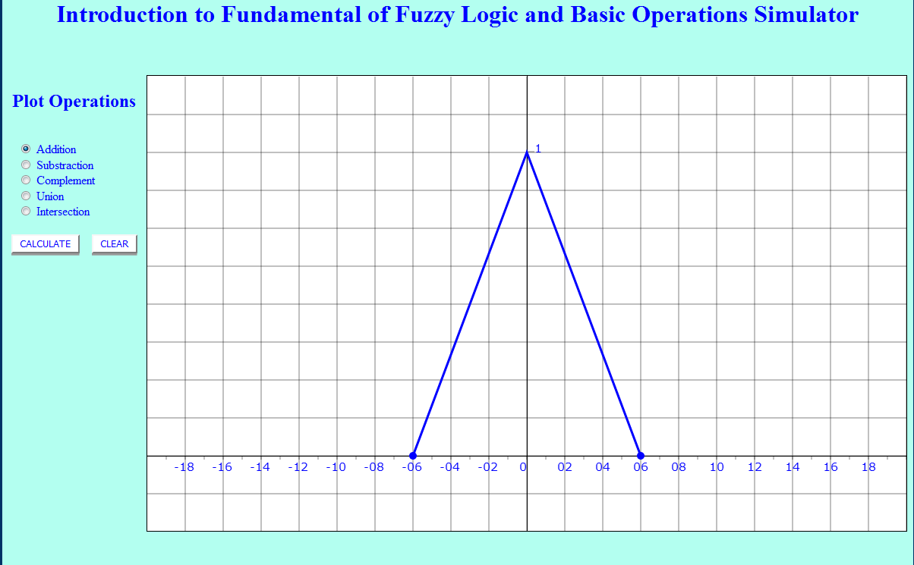
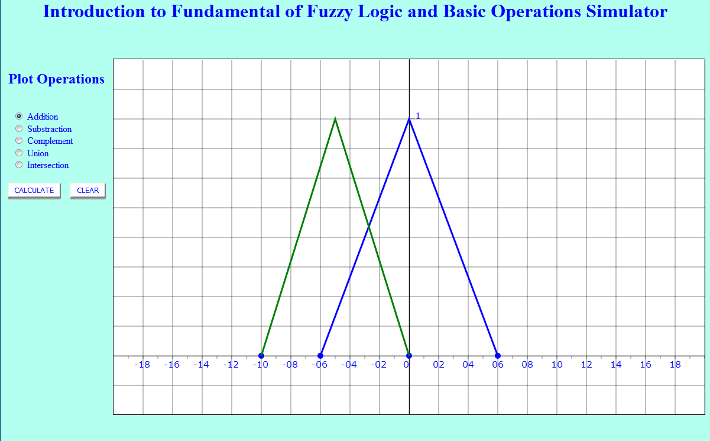
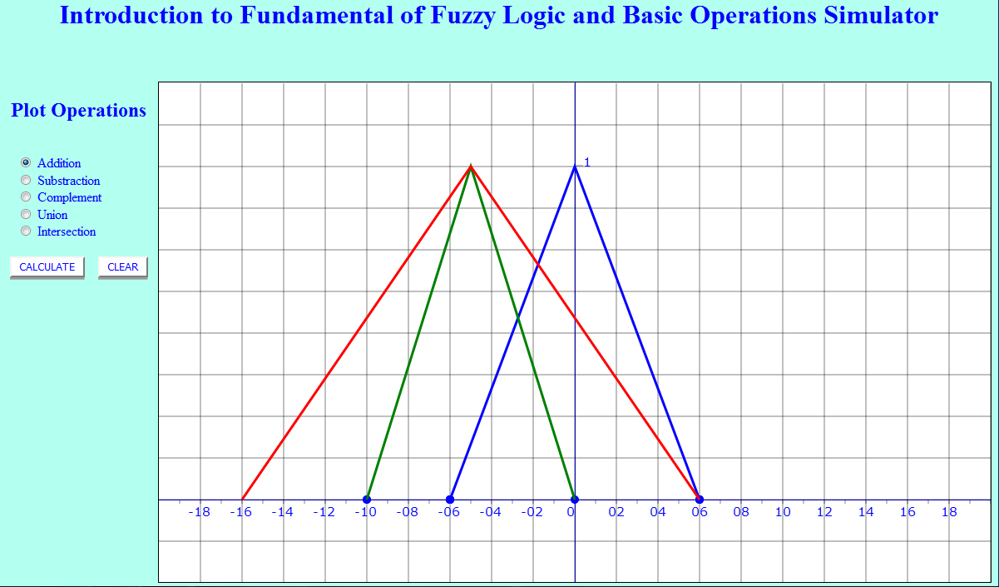
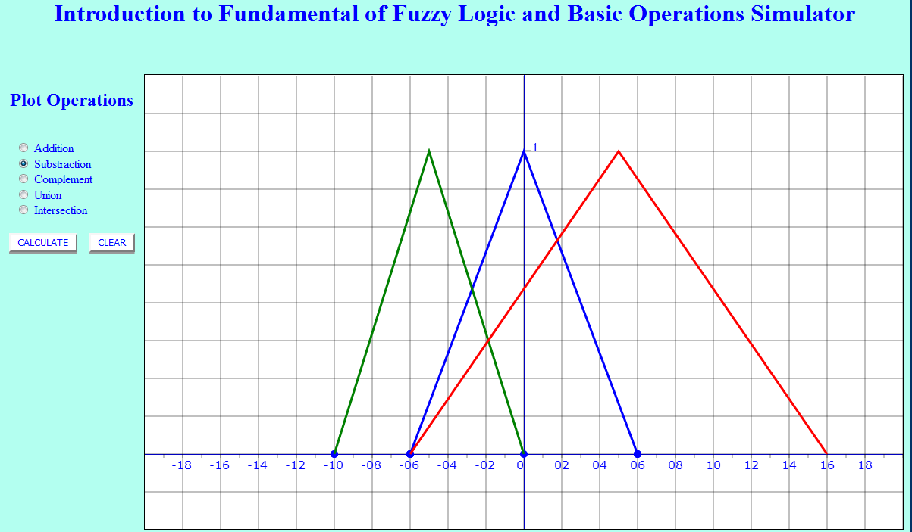
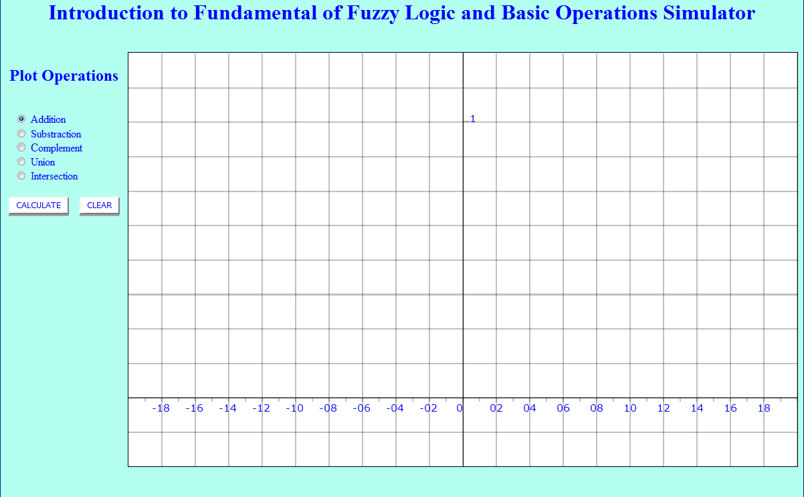
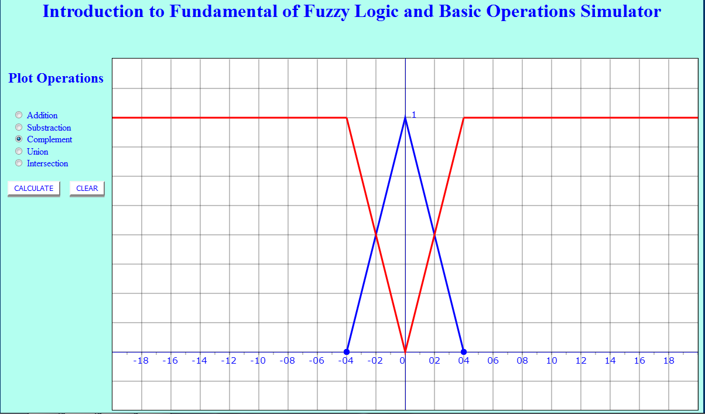
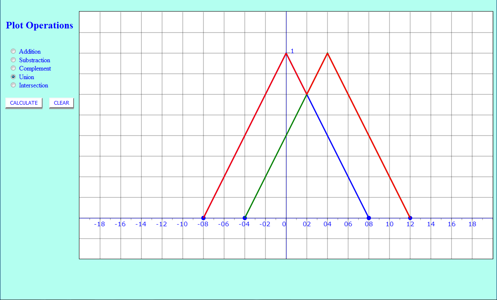
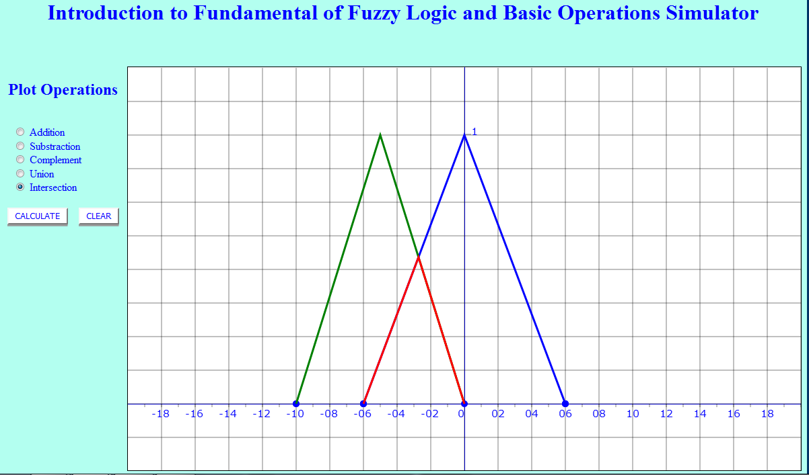

#  Procedure

1. Click two points on reference line to plot Fuzzy Membership function A.

    

    
    

2. Again, Click two points on reference line to plot Fuzzy Membership function B.

    

    
    

3. Select Addition to perform Addition operation of the two membership function A & B.

    

    
    

4. Select Substraction to perform Substraction operation of the two membership function A & B.

    

    
    

5. Click on Clear Button and Perform the experiment again for different membership functions.

    

    
    

6. Similarly, Perform the Same for other Operations.
    Note:In case of Fuzzy Complement operation only One Membership Function will be plotted.

***Fig.1 - Fuzzy Complement***

    

***Fig.2 - Fuzzy Union***

    

***Fig.3 - Fuzzy Intersection***

    